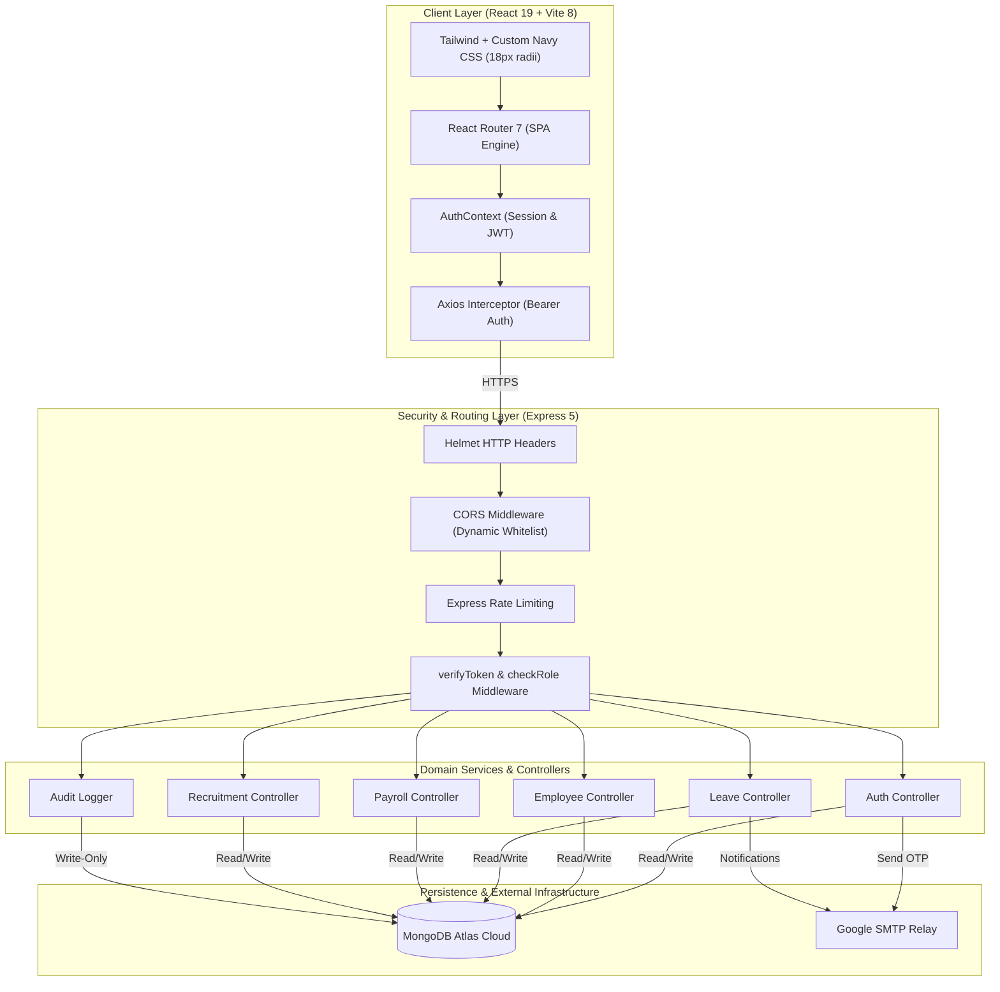

<div align="center">

# 🏛️ Enterprise HR Management System (HRMS)
### Next-Generation Human Capital Governance & Autonomous Workforce Platform

[](https://hr-2027.vercel.app)
[](https://hr-2027.onrender.com/api/health)
[](https://cloud.mongodb.com)
[](https://react.dev)
[](https://nodejs.org)
[-success?style=for-the-badge&logo=checkmarx)](https://hr-2027.onrender.com/api/health)

<p align="center">
  <b>A production-hardened, invite-only enterprise platform orchestrating identity provisioning, multi-tiered hierarchy workflows, attendance telemetry, automated payroll disbursement, OKR goals, ATS recruitment, and immutable audit trails.</b>
</p>

[🌐 Live Production Portal](https://hr-2027.vercel.app) • [📡 Cloud API Health](https://hr-2027.onrender.com/api/health) • [🔑 Verified Credentials](credentials.md) • [📋 Architecture Overview](#-system-architecture--cloud-topology)

---

</div>

## 📌 Executive Summary

The **Enterprise HR Management System (HRMS)** is an institutional-grade, full-stack application architected to manage the complete lifecycle of corporate human capital. Built upon the **MERN** stack (**MongoDB Atlas, Express 5, React 19, Node.js v24, Vite 8**), the platform enforces **zero-trust identity verification**, **hierarchical approval chains**, and **strict role-based resource scoping**.

Every active account is bound to a verified real-world corporate email, ensuring reliable **Google SMTP dispatch** for passwordless 6-digit OTP verification, single-use password resets, leave approvals, and shift alerts.

```
┌─────────────────────────────────────────────────────────────────────────────────────────────────┐
│                                    PLATFORM CAPABILITIES                                        │
├──────────────────────┬──────────────────────┬──────────────────────┬────────────────────────────┤
│ 🔐 Identity & Auth   │ 👥 Workforce Graph   │ ⏱️ Shift Telemetry   │ 💰 Automated Payroll       │
│ • Password + OTP     │ • Strict Hierarchy   │ • 1-Click Clock-In   │ • Salary Breakdowns        │
│ • SHA-256 Hashing    │ • Dept & Team Scoping│ • Hours Calculation  │ • Allowances & Deductions  │
│ • Single-Use Tokens  │ • Manager Assignment │ • Historical Logs    │ • Instant Paystub PDF/CSV  │
├──────────────────────┼──────────────────────┼──────────────────────┼────────────────────────────┤
│ 🏖️ Leave Governance  │ 🎯 Performance OKRs  │ 💼 Recruitment ATS   │ 📜 Audit & Telemetry       │
│ • Multi-Tier Approval│ • Quarterly Cycles   │ • 5-Stage Pipeline   │ • Immutable Logging        │
│ • Real-time Balance  │ • KPI Weightings     │ • Candidate Conversion│ • Sensitive Redaction     │
│ • Auto-Routing       │ • Self/Manager Review│ • Auto-Provisioning  │ • Real-Time Health Probes  │
└──────────────────────┴──────────────────────┴──────────────────────┴────────────────────────────┘
```

---

## 🏗️ System Architecture & Cloud Topology

The platform separates client presentation from server-side domain logic, security pipelines, and cloud database persistence.

### High-Level Architectural Flow

```
                                  USER BROWSER / CLIENT
                                            │
                                            ▼
                        ┌───────────────────────────────────────┐
                        │      Vercel Global Edge Network       │
                        │    (React 19 + Vite 8 Single Page)    │
                        │      https://hr-2027.vercel.app       │
                        └───────────────────┬───────────────────┘
                                            │
                                            │ HTTPS / REST / JSON
                                            │ (Bearer JWT Token)
                                            ▼
                        ┌───────────────────────────────────────┐
                        │       Render Cloud Web Service        │
                        │      (Node.js v24 + Express 5)        │
                        │     https://hr-2027.onrender.com      │
                        ├───────────────────────────────────────┤
                        │ • Helmet Security Headers             │
                        │ • Dynamic CORS Origin Matching        │
                        │ • IP Rate Limiting (1500 req/15m)     │
                        │ • JWT Verification & RBAC Guards      │
                        │ • Domain Controllers & Services       │
                        └───────────────┬───────┬───────────────┘
                                        │       │
                     Mongoose 9 TLS/SSL │       │ Google Cloud SMTP
                                        │       │ (TLS Port 587)
                                        ▼       ▼
         ┌─────────────────────────────────┐ ┌─────────────────────────────────┐
         │       MongoDB Atlas Cloud       │ │     Corporate Email Delivery    │
         │  (Replica Set Clusters / M0)    │ │   (Real-Time 6-Digit OTP /      │
         │   • Users & Roles               │ │    Password Resets / Alerts)    │
         │   • Employees & Departments     │ └─────────────────────────────────┘
         │   • Attendance & Leaves         │
         │   • Payroll & Performance       │
         │   • Audit Logs & Notifications  │
         └─────────────────────────────────┘
```

### Detailed Component Interaction



---

## 🔒 Security Architecture & Zero-Trust Principles

1. **Authentication Engine**:
   * **Dual Login Paradigms**: Enterprise Password-based login alongside Passwordless **Google SMTP 6-Digit OTP** dispatch.
   * **Cryptographic Salt & Pepper**: Passwords hashed using `bcryptjs` with 10 salt rounds.
   * **SHA-256 OTP Storage**: Verification codes are hashed with SHA-256 before database insertion; plain text OTPs are never stored.
   * **Single-Use Reset Tokens**: Forgotten password links utilize cryptographically random tokens with 15-minute expirations, invalidated immediately upon redemption.
2. **Dynamic Cross-Origin Resource Sharing (CORS)**:
   * Origin matching authorizes production frontend (`https://hr-2027.vercel.app`), Vercel preview environments (`*.vercel.app`), and local development environments (`localhost`).
   * Explicit credential passing with `credentials: true` and preflight `204` caching.
3. **Adaptive IP Rate Limiting**:
   * **General Limiter**: 1500 requests per 15-minute window for standard API interactions.
   * **Authentication Limiter**: 200 requests per 15-minute window for `/api/auth/*` endpoints to prevent brute-force attacks.
4. **Data Redaction & Immutable Auditing**:
   * Audit logging captures every state mutation (method, route, user ID, client IP, timestamp).
   * Password hashes, reset tokens, and sensitive personal identifiers are stripped prior to audit persistence.

---

## 🛡️ Multi-Tier Role-Based Access Control (RBAC)

The system enforces strict multi-tenant authorization barriers across **4 organizational tiers**:

```
                              [ LEVEL 1: ADMIN ]
                                      │
                     ┌────────────────┴────────────────┐
                     ▼                                 ▼
              [ LEVEL 2: HR ]                 [ LEVEL 3: MANAGER ]
                     │                                 │
                     └────────────────┬────────────────┘
                                      ▼
                             [ LEVEL 4: EMPLOYEE ]
```

| Operational Dimension | Admin | HR Lead | Manager | Employee |
| :--- | :---: | :---: | :---: | :---: |
| **System Governance & Tenant Settings** | ✅ Full Access | ❌ Restricted | ❌ Restricted | ❌ Restricted |
| **Audit Logs & Redacted System Trails** | ✅ Full Access | ❌ Restricted | ❌ Restricted | ❌ Restricted |
| **Employee Provisioning & Deactivation**| ✅ Full Access | ✅ Full Access | ❌ Restricted | ❌ Restricted |
| **Department Architecture & Assignments**| ✅ Full Access | ✅ Full Access | ❌ Restricted | ❌ Restricted |
| **Direct Team Approvals & Roster** | ✅ All Teams | ✅ All Teams | ✅ Assigned Team | ❌ Restricted |
| **Payroll Generation & Disbursement** | ✅ Global | ✅ Global | ❌ Restricted | ❌ Self Only |
| **Leave Approval Queue** | ✅ Override | ✅ All Requests | ✅ Direct Reports | ❌ Self Requests |
| **ATS Candidate-to-Employee Conversion**| ✅ Global | ✅ Global | ❌ Interview Only| ❌ Restricted |
| **Self-Service Attendance Clock-In** | ✅ Yes | ✅ Yes | ✅ Yes | ✅ Yes |
| **Personal Profile & Paystub Downloads**| ✅ Yes | ✅ Yes | ✅ Yes | ✅ Yes |

---

## 👥 Master Organizational Hierarchy & Live Demo Accounts

The database is seeded with a 6-tier corporate reporting structure backed by verified Gmail accounts for email and OTP delivery:

```
                            Aditya Arora (EMP007)
                      Chief Technology Officer & Director
                                       │
        ┌──────────────────────────────┼──────────────────────────────┐
        ▼                              ▼                              ▼
  Tanishq Goyal (EMP023)    Akshat Wadagbalkar (EMP019)    Chiranthan Suvidh (EMP018)
    Head of People & HR       Cloud & Infra Manager        Software Dev Manager
                                       │                              │
                                       ▼                              ▼
                             Uttkarsh Kumar (EMP020)         Abhik Sinha (EMP021)
                               AI & Cloud Engineer         Backend Software Engineer
```

### Verified Live Demo Credentials

| Role | Employee ID | Name | Registered Corporate Gmail | Default Password | Assigned Department | Direct Manager |
| :--- | :--- | :--- | :--- | :--- | :--- | :--- |
| 🛡️ **Admin** | `EMP007` | Aditya Arora | `a4adityaarora@gmail.com` | `Corp@EMP007#` | Technology & Systems | *Director (Top Level)* |
| 📋 **HR Lead** | `EMP023` | Tanishq Goyal | `tnu23505@gmail.com` | `Corp@EMP023#` | Human Resources | Aditya Arora (`EMP007`) |
| 👔 **Manager** | `EMP019` | Akshat Wadagbalkar | `akshat.wadagbalkar@gmail.com` | `Corp@EMP019#` | Technology & Systems | Aditya Arora (`EMP007`) |
| 👔 **Manager** | `EMP018` | Chiranthan Suvidh | `suvidh.vibrance@gmail.com` | `Corp@EMP018#` | Engineering | Aditya Arora (`EMP007`) |
| 💻 **Employee**| `EMP021` | Abhik Sinha | `abhiksinha06@gmail.com` | `Corp@EMP021#` | Engineering | Chiranthan Suvidh (`EMP018`) |
| 💻 **Employee**| `EMP020` | Uttkarsh Kumar | `u23022686@gmail.com` | `Corp@EMP020#` | Technology & Systems | Akshat Wadagbalkar (`EMP019`) |

*All credentials above are documented and maintained in [`credentials.md`](credentials.md).*

---

## 📦 Monorepo Directory Architecture

The repository maintains an isolated separation between client presentation and backend services:

```
HR-Management-System/
├── .gitignore                          # Monorepo git exclusion definitions
├── credentials.md                      # Master verified user credentials and reporting structure
├── README.md                           # Master architectural reference and deployment guide
│
├── client/                             # Frontend Single Page App (Vercel Ready)
│   ├── vercel.json                     # SPA routing rewrite rule (prevents 404 on refresh)
│   ├── index.html                      # HTML5 web entrypoint
│   ├── vite.config.js                  # Bundler config (React 19 plugin, dev proxy :5000)
│   ├── package.json                    # Client dependencies (React 19, Lucide, Axios, Sonner)
│   ├── src/
│   │   ├── main.jsx                    # React DOM root render
│   │   ├── App.jsx                     # Route table, Route Guards, Context Provider Tree
│   │   ├── index.css                   # Executive Navy design system tokens
│   │   │
│   │   ├── components/                 # Atomic and reusable UI components
│   │   │   ├── common/                 # Metric cards, Action queues, Error boundaries
│   │   │   ├── layout/                 # Topbar with notifications, authenticated shells
│   │   │   ├── navigation/             # Role-filtered responsive sidebar
│   │   │   └── ProtectedRoute.jsx      # Client-side RBAC guard
│   │   │
│   │   ├── context/                    # Global React Contexts
│   │   │   ├── AuthContext.jsx         # User session, JWT lifecycle, auto-logout
│   │   │   └── NotificationContext.jsx # Live in-app alerts and notifications
│   │   │
│   │   ├── pages/                      # Application route views
│   │   │   ├── portal/                 # Gateway role selection & dedicated login views
│   │   │   ├── dashboards/             # Scoped dashboards (Admin, HR, Manager, Employee)
│   │   │   ├── employees/              # Employee directory, detail tabs, profile wizard
│   │   │   ├── departments/            # Department management & roster breakdowns
│   │   │   ├── attendance/             # 1-click Clock-In/Clock-Out & historical shifts
│   │   │   ├── leave/                  # PTO requests & multi-tier manager approval queue
│   │   │   ├── payroll/                # Salary computation, allowance items, paystubs
│   │   │   ├── performance/            # OKR objective tracking & quarterly review forms
│   │   │   ├── recruitment/            # 5-stage candidate ATS & one-click conversion
│   │   │   ├── reports/                # Departmental cross-filtering & CSV exports
│   │   │   ├── notifications/          # Notification inbox & badge management
│   │   │   └── audit/                  # Immutable system trails & security logs
│   │   │
│   │   └── services/                   # Modular API clients
│   │       ├── api.js                  # Centralized Axios client with automatic URL resolution
│   │       └── [domain]Service.js      # Auth, Employee, Leave, Payroll, etc.
│   │
│   └── dist/                           # Production static assets (generated via npm run build)
│
└── server/                             # Backend RESTful API (Render Ready)
    ├── server.js                       # HTTP server entrypoint, lifecycle events, graceful shutdown
    ├── app.js                          # Express 5 initialization, Helmet, CORS, Rate Limiters
    ├── package.json                    # Backend dependencies (Express 5, Mongoose 9, JWT, Nodemailer)
    ├── .env.example                    # Reference environment configuration
    │
    └── src/
        ├── config/
        │   └── db.js                   # Mongoose connection manager with DNS fallback
        │
        ├── models/                     # Mongoose Schema Definitions
        │   ├── User.js                 # Authentication identity & credential hashes
        │   ├── Employee.js             # Institutional workforce metadata & reporting link
        │   ├── Department.js           # Business units, department leads, headcounts
        │   ├── Attendance.js           # Shift records, timestamps, durations
        │   ├── Leave.js                # Leave applications, reason, status, approver ID
        │   ├── Payroll.js              # Earnings, deductions, net pay calculations
        │   ├── Goal.js                 # Performance OKRs, key results, review status
        │   ├── JobApplication.js       # ATS recruitment candidate pipeline
        │   ├── Notification.js         # Targeted in-app alerts and read statuses
        │   ├── AuditLog.js             # Security audit logs with sanitized metadata
        │   └── Otp.js                  # SHA-256 hashed one-time passwords with TTL
        │
        ├── controllers/                # HTTP request handlers & business dispatchers
        ├── middlewares/                # Auth token verification, role checks, error handlers
        ├── routes/                     # REST API route mappings (`/api/*`)
        ├── services/                   # Nodemailer SMTP transport & automated notifications
        └── scripts/                    # Database seed scripts & automated test suites
```

---

## ⚡ Production Deployment Configuration

The application is deployed across **Render** (API runtime) and **Vercel** (SPA frontend).

### 1. Backend on Render (`server/`)
* **Live Service**: [https://hr-2027.onrender.com](https://hr-2027.onrender.com)
* **Root Directory**: `server`
* **Build Command**: `npm install`
* **Start Command**: `npm start`
* **Environment Variables**:
  ```env
  PORT=5000
  NODE_ENV=production
  MONGO_URI=mongodb+srv://<user>:<password>@cluster.mongodb.net/hr_db?retryWrites=true&w=majority
  FRONTEND_URL=https://hr-2027.vercel.app
  JWT_SECRET=<32_character_cryptographic_secret>
  JWT_EXPIRES_IN=24h
  SMTP_HOST=smtp.gmail.com
  SMTP_PORT=587
  SMTP_SECURE=false
  SMTP_EMAIL=your-corporate-email@gmail.com
  SMTP_PASSWORD=your-16-digit-app-password
  EMAIL_FROM="HR Management System" <your-corporate-email@gmail.com>
  ```

### 2. Frontend on Vercel (`client/`)
* **Live Service**: [https://hr-2027.vercel.app](https://hr-2027.vercel.app)
* **Framework Preset**: `Vite`
* **Root Directory**: `client`
* **Build Command**: `npm run build`
* **Output Directory**: `dist`
* **Environment Variables**:
  ```env
  VITE_API_URL=https://hr-2027.onrender.com/api
  ```
* **SPA Routing**: Managed via [`client/vercel.json`](client/vercel.json):
  ```json
  {
    "rewrites": [{ "source": "/(.*)", "destination": "/index.html" }]
  }
  ```

---

## 💻 Local Development Quickstart

### 🚀 Starting Local Development

Run the backend and frontend in two separate terminals:

#### 1. Backend Server
```bash
cd server
npm run dev
```
* **API Entry**: [`http://localhost:5000/api`](http://localhost:5000/api)
* **Health Check**: [`http://localhost:5000/api/health`](http://localhost:5000/api/health)
* **Seed Database**: `npm run seed`

#### 2. Frontend Client
```bash
cd client
npm run dev
```
* **Portal Entry**: [`http://localhost:5173`](http://localhost:5173)
* **Build Production Bundle**: `npm run build`
* **Default Verified Logins**: See [`credentials.md`](credentials.md) (e.g., Admin: `EMP007` / `Corp@EMP007#`)

---

## 🧪 Comprehensive Automated Test Suites

The backend includes **10 automated verification test suites** covering business workflows, security constraints, and live production endpoints:

```bash
cd server
```

```bash
# 1. Verify Live Cloud Deployments (Vercel + Render End-to-End)
node src/scripts/verify_live_deployment.js

# 2. OTP-Based Password Reset & Brute-Force Rate Limiting
node src/scripts/test_forgot_password.js

# 3. Invite-Only Enterprise Access Policy & Google SMTP Dispatch
node src/scripts/test_invite_only_policy.js

# 4. Core Workforce Modules (Employees, Depts, Attendance, Leaves, Payroll)
node src/scripts/test_all_modules_suite.js

# 5. Performance OKRs & Goal Scoring
node src/scripts/test_stage9_performance.js

# 6. Recruitment ATS & Candidate-to-Employee Conversion
node src/scripts/test_stage10_recruitment.js

# 7. Aggregation Reports, Notifications & Redacted Audit Logs
node src/scripts/test_stage11_reports_notifications_audit.js

# 8. End-to-End Security Hardening & Penetration Testing
node src/scripts/test_stage12_hardening_and_e2e.js

# 9. Authentication Token Expiry & Account Deactivation
node src/scripts/test_edge_cases.js

# 10. Multi-Role Resource Scoping & Employee CRUD
node src/scripts/test_employee_suite.js
```

---

## 🎨 Design System & UX Philosophy

* **Color Architecture**: Deep Institutional Navy (`#0B2447`), Trust Indigo (`#2563EB`), Crisp Slate (`#F8FAFC`), and Alert Emerald/Amber/Rose.
* **Component Geometries**: 18px continuous radii on cards and modals, soft shadows, and subtle micro-interaction hover lifts (`translateY(-2px)`).
* **Responsive Layouts**: Collapsible sidebar navigation, mobile viewports with hamburger menus, and accessible contrast ratios across all dashboards.
* **Telemetry & Feedback**: Asynchronous notifications dispatched via `Sonner` toasts with contextual action triggers.

---

<div align="center">

<b>Enterprise Human Resource Management System</b>  
Architected with ❤️ for modern, scalable human capital operations.

</div>
