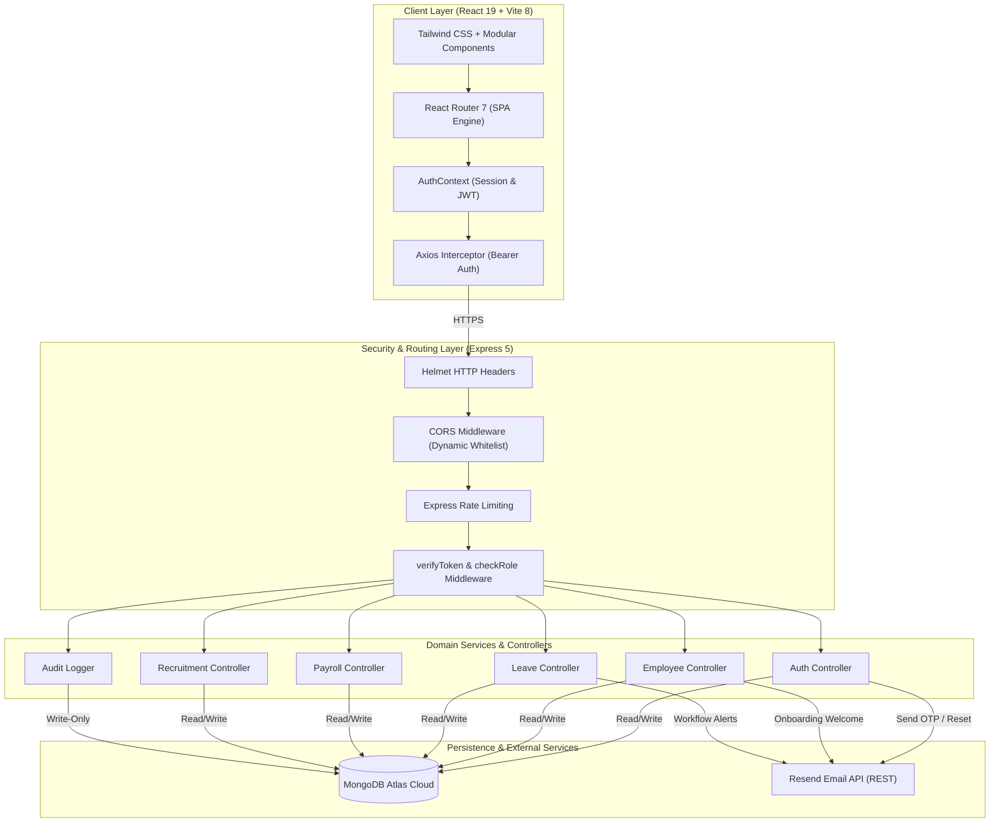

<div align="center">

# 🏛️ Enterprise HR Management System (HRMS)
### Modern Workforce Management, Identity Governance & Automated Operations

[](https://workops-22.vercel.app/)
[](https://hr-2027.onrender.com/api/health)
[](https://cloud.mongodb.com)
[](https://react.dev)
[](https://nodejs.org)

<p align="center">
  A streamlined full-stack enterprise workforce platform built for employee lifecycle management, multi-tiered hierarchy workflows, real-time shift tracking, automated payroll, performance OKRs, ATS hiring pipelines, and secure role-scoped operations.
</p>

[🌐 Open Live Application](https://workops-22.vercel.app/) • [🔑 Pre-Configured Role Credentials](#-pre-configured-role-credentials) • [🛡️ Multi-Tier RBAC](#-multi-tier-role-based-access-control-rbac) • [🔒 Security Principles](#-security-architecture--zero-trust-principles)

---

</div>

## 🔑 Pre-Configured Role Credentials

Instant access credentials verified directly against **MongoDB Atlas** for exploring each isolated role workflow in the live production environment. You can sign in using either the **Employee ID** or **Email Address**.

| Role & Tier | Employee ID | Name & Designation | Registered Email | Verified Password | One-Click Login Portal |
| :--- | :--- | :--- | :--- | :--- | :---: |
| 🛡️ **Admin** | `EMP007` | **Aditya Arora**<br><sub>Chief Technology Officer & Director</sub> | `a4adityaarora@gmail.com` | `Corp@EMP007#` | [Enter as Admin →](https://workops-22.vercel.app/admin/login) |
| 📋 **HR Lead** | `EMP023` | **Tanishq Goyal**<br><sub>Head of People Operations & HR Lead</sub> | `tnu23505@gmail.com` | `Corp@EMP023#` | [Enter as HR →](https://workops-22.vercel.app/hr/login) |
| 👔 **Manager** | `EMP019` | **Akshat Wadagbalkar**<br><sub>Cloud & Infra Engineering Manager</sub> | `akshat.wadagbalkar@gmail.com` | `Corp@EMP019#` | [Enter as Manager →](https://workops-22.vercel.app/manager/login) |
| 👔 **Manager** | `EMP018` | **Chiranthan Suvidh**<br><sub>Software Development Manager</sub> | `suvidh.vibrance@gmail.com` | `Corp@EMP018#` | [Enter as Manager →](https://workops-22.vercel.app/manager/login) |
| 💻 **Employee** | `EMP021` | **Abhik Sinha**<br><sub>Backend Software Engineer (Reports to EMP018)</sub> | `abhiksinha06@gmail.com` | `Corp@EMP021#` | [Enter as Employee →](https://workops-22.vercel.app/employee/login) |
| 💻 **Employee** | `EMP020` | **Uttkarsh Kumar**<br><sub>AI & Cloud Engineer (Reports to EMP019)</sub> | `u23022686@gmail.com` | `Corp@EMP020#` | [Enter as Employee →](https://workops-22.vercel.app/employee/login) |

> [!TIP]
> **Authentication Options**: Each portal supports standard password authentication with the verified passwords above, as well as passwordless **6-digit Email OTP** verification dispatched in real time to the user's registered inbox.

---

## ✨ Key Platform Highlights

| Module | Core Capabilities | Operational Value |
| :--- | :--- | :--- |
| 🔐 **Identity & Auth** | Password & passwordless 6-digit OTP verification, single-use token resets | Eliminates credential sprawl with zero-trust token enforcement |
| 👥 **Workforce Directory** | Multi-tier reporting hierarchy, department scoping, role-gated access | Direct visibility into organizational lines and reporting trees |
| ⏱️ **Attendance Telemetry** | 1-click Shift Clock-In/Out, active duration timers, historical logs | Transparent shift accounting with instant status indicators |
| 🏖️ **Leave Governance** | Multi-tiered approval chains, quota tracking, instant manager alerts | Automated routing to designated supervisors with real-time balance checks |
| 💰 **Automated Payroll** | Base salary, allowances, deductions, net pay computation, PDF/CSV stubs | Accurate disbarment calculations and instant employee self-service |
| 🎯 **Performance OKRs** | Quarterly objective cycles, key results weighting, self & manager reviews | Clear KPI progress tracking and structured performance assessments |
| 💼 **ATS Recruitment** | 5-stage candidate pipeline (Applied ➔ Screened ➔ Interview ➔ Offer ➔ Hired) | 1-click candidate-to-employee conversion with automated welcome credentials |
| 📜 **Audit & Telemetry** | Immutable action logging with sensitive credential redaction | Comprehensive compliance traceability across administrative operations |

---

## 🔄 Detailed Component Interaction



---

## 🔒 Security Architecture & Zero-Trust Principles

1. **Authentication Engine**:
   * **Dual Login Paradigms**: Enterprise password authentication paired with passwordless **Resend-powered 6-digit OTP** email verification.
   * **Cryptographic Salting**: Passwords hashed securely using `bcryptjs` with 10 salt rounds.
   * **SHA-256 OTP Storage**: Verification codes are hashed with SHA-256 before persistence; plain text OTPs are never stored in the database.
   * **Single-Use Reset Tokens**: Forgotten password workflows generate cryptographically random tokens with 15-minute expiration windows, invalidated immediately upon use.
2. **Dynamic Cross-Origin Resource Sharing (CORS)**:
   * Origin matching authorizes the live production frontend (`https://workops-22.vercel.app`), preview deployments, and development origins.
   * Configured with explicit `credentials: true` support and preflight `204` caching.
3. **Adaptive IP Rate Limiting**:
   * **General Limiter**: 1500 requests per 15-minute window for standard API operations.
   * **Authentication Limiter**: 200 requests per 15-minute window on `/api/auth/*` endpoints to defend against brute-force attacks.
4. **Data Redaction & Immutable Auditing**:
   * Audit logging records all state mutations (HTTP method, endpoint, user identifier, client IP, timestamp).
   * Password hashes, tokens, and sensitive personal identifiers are strictly sanitized prior to log storage.

---

## 🛡️ Multi-Tier Role-Based Access Control (RBAC)

The system enforces strict multi-tier authorization barriers across 4 organizational roles:

```
                              [ LEVEL 1: ADMIN ]
                                      │
                     ┌────────────────┴────────────────┐
                     ▼                                 ▼
              [ LEVEL 2: HR ]                 [ LEVEL 3: MANAGER ]
                     │                                 │
                     └────────────────┬────────────────┘
                                      ▼
                             [ LEVEL 4: EMPLOYEE ]
```

| Operational Scope | Admin | HR Lead | Manager | Employee |
| :--- | :---: | :---: | :---: | :---: |
| **System Governance & Global Settings** | ✅ Full Access | ❌ Restricted | ❌ Restricted | ❌ Restricted |
| **Audit Logs & System Mutation Trails** | ✅ Full Access | ❌ Restricted | ❌ Restricted | ❌ Restricted |
| **Employee Provisioning & Offboarding** | ✅ Full Access | ✅ Full Access | ❌ Restricted | ❌ Restricted |
| **Department Architecture & Assignments**| ✅ Full Access | ✅ Full Access | ❌ Restricted | ❌ Restricted |
| **Team Approvals & Direct Report Roster**| ✅ All Teams | ✅ All Teams | ✅ Assigned Team | ❌ Restricted |
| **Payroll Generation & Disbursement** | ✅ Global | ✅ Global | ❌ Restricted | ❌ Self Only |
| **Leave Approval Queue** | ✅ Override | ✅ All Requests | ✅ Direct Reports | ❌ Self Requests |
| **ATS Candidate-to-Employee Conversion**| ✅ Global | ✅ Global | ❌ Interview Only| ❌ Restricted |
| **Self-Service Attendance Clock-In** | ✅ Yes | ✅ Yes | ✅ Yes | ✅ Yes |
| **Personal Profile & Paystub Downloads**| ✅ Yes | ✅ Yes | ✅ Yes | ✅ Yes |

---

## ⚡ Production Cloud Deployment

The application is deployed across **Render** (REST API runtime) and **Vercel** (Edge SPA client).

### 1. Backend Service (Render)
* **Live Service**: [https://hr-2027.onrender.com](https://hr-2027.onrender.com)
* **API Health Check**: [`/api/health`](https://hr-2027.onrender.com/api/health)
* **Environment Configuration**:
  ```env
  PORT=5000
  NODE_ENV=production
  MONGODB_URI=mongodb+srv://<username>:<password>@<cluster>.mongodb.net/hrms_db?retryWrites=true&w=majority
  FRONTEND_URL=https://workops-22.vercel.app
  CLIENT_URL=https://workops-22.vercel.app
  JWT_SECRET=<secure_32_character_secret>
  JWT_EXPIRES_IN=24h
  RESEND_API_KEY=re_your_resend_api_key_here
  RESEND_FROM="HR Management System <onboarding@resend.dev>"
  ```

### 2. Frontend Client (Vercel)
* **Live Application**: [https://workops-22.vercel.app](https://workops-22.vercel.app)
* **Framework Preset**: Vite + React 19 SPA
* **Environment Configuration**:
  ```env
  VITE_API_URL=https://hr-2027.onrender.com/api
  ```
* **SPA Routing Configuration** (`vercel.json`):
  ```json
  {
    "rewrites": [{ "source": "/(.*)", "destination": "/index.html" }]
  }
  ```

---

<div align="center">

<b>Enterprise Human Resource Management System</b>  
Architected for modern, secure, and scalable workforce operations.

</div>
