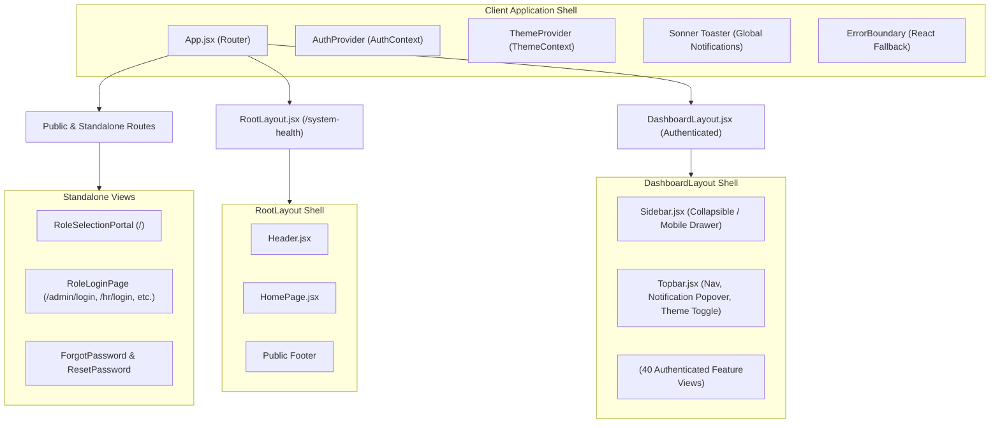
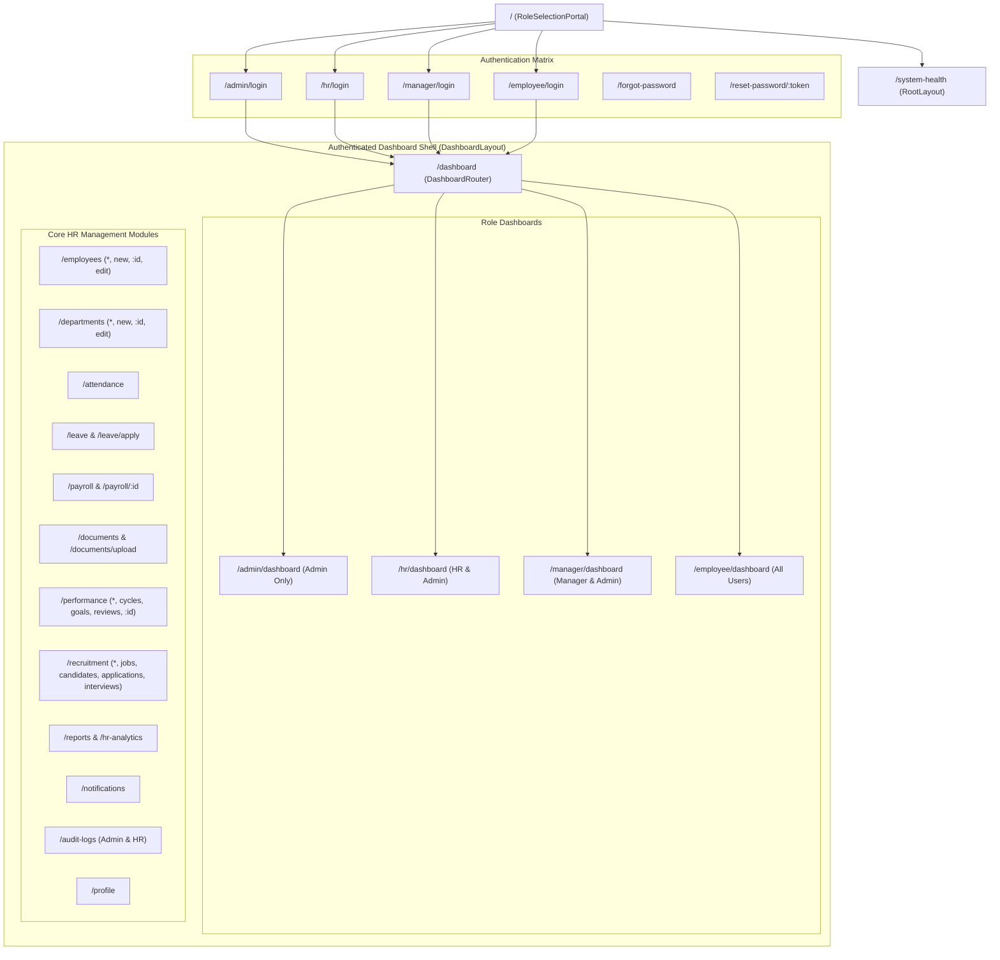
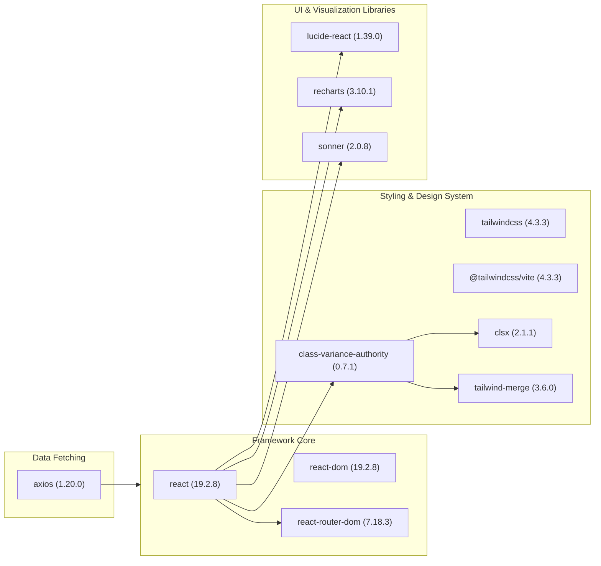

# Frontend UI Audit: Enterprise Human Resource Management Suite (HRMS)

**Workspace Path:** `D:\Projects\HRMS`  
**Frontend Application:** `client/`  
**Audit Mode:** Strict Read-Only  
**Generated On:** March 2026  
**Auditor:** Antigravity UI Systems Engineering Agent  

---

## Executive Summary

This document presents a comprehensive, production-grade frontend UI audit of the **Enterprise HRMS** platform (`D:\Projects\HRMS`). The application is an enterprise-tier Single Page Application (SPA) designed to serve four specialized corporate personas: **Super Administrator**, **Human Resources Specialist**, **People Manager**, and **Individual Contributor / Employee**. 

The client architecture is powered by **React 19.2.8** running atop **Vite 8.2.2** and styled via a dual-engine paradigm combining **Tailwind CSS v4.3.3** (`@tailwindcss/vite`) with **3,116 lines of custom CSS design tokens, components, and layout primitives** (`client/src/index.css`). Across 46 dedicated routes, the user interface features modular component architectures, role-aware sidebar navigation, a live system notification hub, an interactive ATS recruitment Kanban board, Recharts-powered analytics dashboards, and a robust multi-theme engine supporting light, dark, and system color preferences.

---

## 1. Project Overview

### Technical Stack & Dependencies

| Layer | Technology | Version | Key Notes & Architectural Function |
| :--- | :--- | :--- | :--- |
| **Runtime Framework** | React | `^19.2.8` | Core UI component library utilizing React 19 functional components & hooks. |
| **DOM Renderer** | React DOM | `^19.2.8` | Client-side DOM rendering root (`client/src/main.jsx`). |
| **Bundler & Build Tool** | Vite | `^8.2.2` | High-performance ESM build tool with fast HMR (`vite.config.js`). |
| **Styling Engine** | Tailwind CSS | `^4.3.3` | Tailwind v4 integrated via official `@tailwindcss/vite` plugin. |
| **CSS Architecture** | Custom CSS Tokens & Primitives | — | 3,116-line custom stylesheet (`src/index.css`) defining variables, components, and utilities. |
| **Component Variant Engine** | Class Variance Authority (CVA) | `^0.7.1` | Type-safe variant management for buttons, badges, inputs, and cards. |
| **Class Merging** | `clsx` + `tailwind-merge` | `2.1.1` / `3.6.0` | Helper utility `cn()` (`client/src/lib/utils.js`) for conflict-free class composition. |
| **Routing Engine** | React Router DOM | `^7.18.3` | Declarative routing with nested layouts, guards, and dynamic parameter parsing. |
| **Iconography** | Lucide React | `^1.39.0` | 240+ modern, consistent SVG vector icons with customizable stroke width. |
| **Charts & Data Viz** | Recharts | `^3.10.1` | Declarative SVG charting library for bar, line, area, and pie visualizations. |
| **Toast & Notifications** | Sonner | `^2.0.8` | Headless, accessible toast notification system mounted globally in `main.jsx`. |
| **HTTP & API Client** | Axios | `^1.20.0` | Promise-based HTTP client with request/response interceptors (`src/services/api.js`). |
| **Typography** | Google Fonts (Inter & JetBrains Mono) | Web CDN | Preconnected web fonts delivering clean UI sans-serif and tabular monospace numerals. |

### Theme System Architecture

The application implements a multi-tier theme synchronization engine managed through `client/src/context/ThemeContext.jsx`:
1. **Three Selectable States**: `'light'`, `'dark'`, and `'system'`.
2. **System Preference Observer**: Dynamically attaches `window.matchMedia('(prefers-color-scheme: dark)')` event listeners to sync with OS dark mode toggles in real time.
3. **Cross-Tab Synchronization**: Watches `window.addEventListener('storage')` on the `hrms-theme` localStorage key.
4. **DOM Synchronization**: Immediately updates both `document.documentElement.classList` (`dark`) and `document.documentElement.setAttribute('data-theme', theme)` alongside `style.colorScheme`.
5. **FOUC Prevention**: Inline blocking JavaScript in `client/index.html` (lines 12-26) resolves and injects the dark class prior to DOM paint.

---

## 2. Folder Tree

```text
client/
├── index.html                           # HTML5 entry point with preconnected Google Fonts and anti-FOUC theme script
├── package.json                         # Dependencies and npm build scripts
├── package-lock.json                    # Locked dependency tree
├── vite.config.js                       # Vite 8 config with @tailwindcss/vite & @vitejs/plugin-react
├── public/
│   ├── favicon.svg                      # Enterprise HRMS favicon mark
│   └── icons.svg                        # Multi-symbol SVG sprite definition
└── src/
    ├── main.jsx                         # Application bootstrapping, StrictMode, ErrorBoundary, ThemeProvider, Toaster
    ├── App.jsx                          # Central routing manifest, protected route hierarchy, and stage mappings
    ├── App.css                          # Legacy sample CSS styles
    ├── index.css                        # 3,116 lines: CSS variables, dark mode variants, CVA utilities, and components
    ├── assets/
    │   ├── hero.png                     # Visual hero illustration used in RoleSelectionPortal
    │   ├── react.svg                    # Default React logo asset
    │   └── vite.svg                     # Default Vite logo asset
    ├── components/
    │   ├── Header.jsx                   # Standalone public navigation header for system health
    │   ├── ProtectedRoute.jsx           # Higher-order auth & RBAC route guard component
    │   ├── StatusBadge.jsx              # Status indicator badge with pulsing status dots
    │   ├── auth/
    │   │   └── ForgotPasswordModal.jsx  # Multi-step OTP password reset dialog
    │   ├── common/
    │   │   ├── ActionQueue.jsx          # Workflow task queue card for pending supervisor actions
    │   │   ├── ConfirmModal.jsx         # Accessible destructive/confirmation action dialog
    │   │   ├── EmptyState.jsx           # Reusable empty data illustration and CTA container
    │   │   ├── ErrorBoundary.jsx        # Class-based React Error Boundary with recovery button
    │   │   ├── ForbiddenPage.jsx        # 403 Access Denied fallback view for unauthorized roles
    │   │   ├── LoadingSpinner.jsx       # Universal CSS spinner with size and role color variants
    │   │   ├── StatCard.jsx             # Metric KPI card with trend indicators and sparkline support
    │   │   └── ThemeToggle.jsx          # Segmented pill and icon button theme switchers
    │   ├── layout/
    │   │   ├── DashboardLayout.jsx      # Core authenticated layout shell with responsive drawer
    │   │   ├── Sidebar.jsx              # Collapsible role-based navigation sidebar with user badge
    │   │   └── Topbar.jsx               # Breadcrumbs, live notification popover, theme toggle, and profile ring
    │   ├── navigation/
    │   │   └── navConfig.js             # Declarative role-based menu matrices (admin, hr, manager, employee)
    │   └── ui/
    │       ├── badge.jsx                # CVA badge component with pill, dot, and role accent variants
    │       ├── button.jsx               # CVA button component with size, intent, and loading state props
    │       ├── card.jsx                 # Composable card primitives (Card, Header, Title, Content, Footer)
    │       └── input.jsx                # Accessible input component with floating focus rings and error states
    ├── context/
    │   ├── AuthContext.jsx              # Global authentication context provider (JWT token, user state, login/logout)
    │   ├── authContextDef.js            # Initial context state definitions
    │   └── ThemeContext.jsx             # Theme state provider (light/dark/system, localStorage, media query listener)
    ├── hooks/
    │   ├── useAuth.js                   # Custom hook consumer for AuthContext
    │   └── useHealth.js                 # Custom polling hook for backend health check endpoints
    ├── layouts/
    │   └── RootLayout.jsx               # Public system health monitor layout wrapper with Header & Footer
    ├── lib/
    │   └── utils.js                     # Tailored `cn()` utility combining clsx and twMerge
    ├── pages/
    │   ├── HomePage.jsx                 # Backend API health monitor and connectivity dashboard
    │   ├── LoginPage.jsx                # Legacy unified login screen
    │   ├── DashboardPage.jsx            # Legacy overview dashboard
    │   ├── attendance/
    │   │   └── AttendancePage.jsx       # Daily attendance log, punch in/out modal, and time tracking
    │   ├── audit/
    │   │   └── AuditLogsPage.jsx        # Security compliance audit trail with JSON payload inspect modal
    │   ├── common/
    │   │   ├── PlaceholderModulePage.jsx# Generalized future-stage preview component
    │   │   └── ProfilePage.jsx          # User personal profile, security credentials, and document list
    │   ├── dashboards/
    │   │   ├── AdminDashboard.jsx       # Organization overview, user counts, system metrics, and audit widgets
    │   │   ├── DashboardRouter.jsx      # Dynamic redirector dispatching user to their specific dashboard
    │   │   ├── EmployeeDashboard.jsx    # Self-service hub: attendance punch, leave balance, payslips, quick tasks
    │   │   ├── HrDashboard.jsx          # Workforce stats, recruitment pipeline, pending leaves, department headcounts
    │   │   └── ManagerDashboard.jsx     # Team performance, pending leave approvals, direct reports overview
    │   ├── departments/
    │   │   ├── DepartmentCreatePage.jsx # New department form with manager assignment
    │   │   ├── DepartmentDetailPage.jsx # Department roster, budget allocation, and active projects
    │   │   ├── DepartmentEditPage.jsx   # Department update form
    │   │   └── DepartmentListPage.jsx   # Filterable grid/list view of corporate departments
    │   ├── documents/
    │   │   ├── DocumentListPage.jsx     # Categorized company and employee document repository
    │   │   └── DocumentUploadPage.jsx   # Multi-file drag-and-drop document upload interface
    │   ├── employees/
    │   │   ├── EmployeeCreatePage.jsx   # Multi-tab new hire onboarding form (Personal, Job, Compensation, Emergency)
    │   │   ├── EmployeeDetailPage.jsx   # 360-degree employee profile, documents, attendance, and salary history
    │   │   ├── EmployeeEditPage.jsx     # Comprehensive employee information modification form
    │   │   └── EmployeeListPage.jsx     # Advanced paginated table with search, role filters, and export buttons
    │   ├── leave/
    │   │   ├── LeaveApplyPage.jsx       # Leave application form with balance calculations and attachment upload
    │   │   └── LeavePage.jsx            # Leave requests list, status badges, and manager approval queues
    │   ├── notifications/
    │   │   └── NotificationsPage.jsx    # Full-page notification center with filter tabs and batch actions
    │   ├── payroll/
    │   │   ├── PayrollDetailPage.jsx    # Detailed salary slip view with earnings/deductions breakdown and PDF print
    │   │   └── PayrollPage.jsx          # Payroll batches, monthly generation, status filters, and export
    │   ├── performance/
    │   │   ├── PerformanceCyclesPage.jsx# Appraisal cycles setup, start/end dates, and participant milestones
    │   │   ├── PerformanceDashboardPage.jsx # Performance metrics, distribution curves, and KPI completions
    │   │   ├── PerformanceGoalsPage.jsx # OKR and goal tracking with progress sliders and status tags
    │   │   ├── PerformanceReviewDetailPage.jsx # Individual review form with rating sliders and supervisor comments
    │   │   └── PerformanceReviewsPage.jsx # List of active reviews grouped by reviewer status
    │   ├── portal/
    │   │   ├── ForgotPasswordPage.jsx   # Standalone password recovery view
    │   │   ├── ResetPasswordPage.jsx    # New password submission screen with token verification
    │   │   ├── RoleLoginPage.jsx        # Role-branded dedicated login portal (Admin, HR, Manager, Employee)
    │   │   └── RoleSelectionPortal.jsx  # Primary application landing page with persona selection cards
    │   ├── recruitment/
    │   │   ├── ApplicationDetailPage.jsx# Candidate application timeline, resume viewer, and interview stage tracker
    │   │   ├── ApplicationsKanbanPage.jsx# Drag-and-drop / stage-based ATS recruitment Kanban pipeline
    │   │   ├── CandidateDetailPage.jsx  # Candidate bio, interview history, evaluation scores, and notes
    │   │   ├── CandidatesPage.jsx       # Candidate directory with skill tags and status indicators
    │   │   ├── InterviewsPage.jsx       # Interview schedule calendar, panelist assignments, and status
    │   │   ├── JobOpeningCreatePage.jsx # Requisition requisition form (Title, Department, Salary, Requirements)
    │   │   ├── JobOpeningDetailPage.jsx # Job details, applicants counter, and hiring team list
    │   │   ├── JobOpeningsPage.jsx      # Job listings board with status toggles (Draft, Published, Closed)
    │   │   └── RecruitmentDashboardPage.jsx # Recruitment metrics: Time to Hire, Pipeline Stage counts, Sourcing charts
    │   └── reports/
    │       └── ReportsDashboardPage.jsx # Comprehensive HR analytics dashboard with Recharts visualizations
    └── services/
        ├── api.js                       # Central Axios instance with JWT authorization bearer interceptors
        ├── attendanceService.js         # Check-in, check-out, monthly logs, and summary metrics APIs
        ├── auditService.js              # Audit log querying, filtering, and export APIs
        ├── authService.js               # Login, logout, refresh, and password recovery endpoints
        ├── departmentService.js         # Department CRUD and staff allocation APIs
        ├── documentService.js           # Document upload, download, categorizing, and deletion APIs
        ├── employeeService.js           # Employee profile, directory search, onboarding, and offboarding APIs
        ├── healthService.js             # System status, DB connectivity, and latency check APIs
        ├── leaveService.js              # Leave balances, submission, cancellation, and approval APIs
        ├── notificationService.js       # In-app notifications fetch, unread counter, and mark-read APIs
        ├── payrollService.js            # Salary structure, payslip calculation, batch run, and PDF APIs
        ├── performanceService.js        # Performance cycles, goals, 360 reviews, and scoring APIs
        ├── recruitmentService.js        # Job openings, candidate profiles, pipeline stages, and interview APIs
        └── reportService.js             # Workforce turnover, attendance analytics, and payroll expenditure APIs
```

---

## 3. Pages Inventory

The following master inventory documents all **46 accessible frontend routes and pages** within the Enterprise HRMS application:

| # | Page / Module Name | Route / Path | File Location | Layout Applied | Role Protection | Key UI Components | Data Sources & APIs | Responsive Breakpoint Details |
| :-: | :--- | :--- | :--- | :--- | :--- | :--- | :--- | :--- |
| **1** | **Role Selection Portal** | `/` | `pages/portal/RoleSelectionPortal.jsx` | None (Standalone) | Public | Persona Cards, Hero Illustration, System Badge, Quick Demo Logins | Static / Demo presets | Responsive grid: 1 col on mobile, 2 col on md, 4 col on xl |
| **2** | **System Health Monitor** | `/system-health` | `pages/HomePage.jsx` | `RootLayout` | Public | StatusBadge, Server Metrics Grid, Polling Controls, Raw JSON viewer | `healthService.getHealth()` | 1 col mobile, 3 col desktop; horizontal table scroll on `<640px` |
| **3** | **Unified Login (Legacy)** | `/login` | `pages/LoginPage.jsx` | None (Standalone) | Public | Auth Form, Credential Inputs, Role Radio Group, Submit Button | `authService.login()` | Centered card (`max-w-md`), 100% width on `<480px` |
| **4** | **Admin Dedicated Login** | `/admin/login` | `pages/portal/RoleLoginPage.jsx` | None (Standalone) | Public | Role Accent Header, Admin Security Badge, Password Field, Forgot Link | `authService.login()` | Centered card (`max-w-[440px]`), full padding adapt on mobile |
| **5** | **HR Specialist Login** | `/hr/login` | `pages/portal/RoleLoginPage.jsx` | None (Standalone) | Public | Emerald Accent Theme, HR Portal Icon, Credential Form | `authService.login()` | Centered card (`max-w-[440px]`) |
| **6** | **Team Manager Login** | `/manager/login` | `pages/portal/RoleLoginPage.jsx` | None (Standalone) | Public | Indigo Accent Theme, Management Shield Icon, Login Form | `authService.login()` | Centered card (`max-w-[440px]`) |
| **7** | **Employee Portal Login** | `/employee/login` | `pages/portal/RoleLoginPage.jsx` | None (Standalone) | Public | Sky Accent Theme, Self-Service Mark, Sign-In Form | `authService.login()` | Centered card (`max-w-[440px]`) |
| **8** | **Forgot Password Page** | `/forgot-password` | `pages/portal/ForgotPasswordPage.jsx` | None (Standalone) | Public | Email Input, Instruction Callout, Return to Login Link | `authService.forgotPassword()` | Centered container (`max-w-md`), mobile fluid |
| **9** | **Reset Password Screen** | `/reset-password`, `/reset-password/:token` | `pages/portal/ResetPasswordPage.jsx` | None (Standalone) | Public | Password Strength Meter, Confirm Password Field, Success Screen | `authService.resetPassword()` | Centered container (`max-w-md`), mobile fluid |
| **10** | **Dynamic Dashboard Router** | `/dashboard` | `pages/dashboards/DashboardRouter.jsx` | `DashboardLayout` | Authenticated | LoadingSpinner, Router Redirect Logic | `AuthContext` user role state | Transparent redirect wrapper |
| **11** | **Super Admin Dashboard** | `/admin/dashboard` | `pages/dashboards/AdminDashboard.jsx` | `DashboardLayout` | `admin` | StatCards, System Activity Feed, User Counters, Quick Admin Actions | `reportService`, `auditService` | 4-col stat grid on desktop, 2-col tablet, 1-col mobile |
| **12** | **HR Overview Dashboard** | `/hr/dashboard` | `pages/dashboards/HrDashboard.jsx` | `DashboardLayout` | `hr`, `admin` | Workforce Metrics, Leave Approvals Widget, Recruitment Bar Chart | `reportService`, `employeeService` | Grid columns: 4 on xl, 2 on md, 1 on sm |
| **13** | **Manager Team Console** | `/manager/dashboard` | `pages/dashboards/ManagerDashboard.jsx` | `DashboardLayout` | `manager`, `admin` | Team Presence Gauge, Pending Leave Approvals, Performance Alerts | `employeeService`, `leaveService` | Fluid 2-column dashboard layout collapsing on `<768px` |
| **14** | **Employee Workspace** | `/employee/dashboard` | `pages/dashboards/EmployeeDashboard.jsx` | `DashboardLayout` | All Roles | Punch In/Out Card, Leave Balance Pills, Recent Payslips, Announcements | `attendanceService`, `leaveService` | Hero punch widget full-width on mobile, cards grid on desktop |
| **15** | **Employee Directory** | `/employees` | `pages/employees/EmployeeListPage.jsx` | `DashboardLayout` | Authenticated | Search Bar, Department Filter, Status Badge, Employee Data Table | `employeeService.getEmployees()` | Table with `overflow-x-auto`; hidden non-essential cols on mobile |
| **16** | **New Employee Onboarding** | `/employees/new` | `pages/employees/EmployeeCreatePage.jsx` | `DashboardLayout` | `admin`, `hr` | Multi-step Tabs, Form Inputs, Emergency Contact Fields, Role Selector | `employeeService.createEmployee()` | 2-column form grid collapsing to 1-column on `<768px` |
| **17** | **Employee 360 Detail** | `/employees/:id` | `pages/employees/EmployeeDetailPage.jsx` | `DashboardLayout` | Authenticated | Profile Hero, Attendance Tab, Document Vault, Salary Info, Edit Button | `employeeService.getEmployeeById()` | Tab navigation wraps on small screens; details sidebar stacks below |
| **18** | **Edit Employee Profile** | `/employees/:id/edit` | `pages/employees/EmployeeEditPage.jsx` | `DashboardLayout` | `admin`, `hr` | Pre-populated Form Fields, Role Assignment, Status Switch, Save Button | `employeeService.updateEmployee()` | 2-column form grid with sticky submit footer on mobile |
| **19** | **Departments Directory** | `/departments` | `pages/departments/DepartmentListPage.jsx` | `DashboardLayout` | Authenticated | Department Cards, Headcount Counters, Budget Indicators, Create CTA | `departmentService.getDepartments()` | 3-column card grid on desktop, 2-column tablet, 1-column mobile |
| **20** | **Create Department** | `/departments/new` | `pages/departments/DepartmentCreatePage.jsx` | `DashboardLayout` | `admin`, `hr` | Name Input, Code Input, Manager Dropdown, Description Textarea | `departmentService.createDepartment()` | Card container (`max-w-2xl`) centered |
| **21** | **Department Detail** | `/departments/:id` | `pages/departments/DepartmentDetailPage.jsx` | `DashboardLayout` | Authenticated | Member Table, Budget Chart, Manager Contact Card | `departmentService.getDepartmentById()` | Split desktop view (70/30) collapsing to single column on tablet |
| **22** | **Edit Department** | `/departments/:id/edit` | `pages/departments/DepartmentEditPage.jsx` | `DashboardLayout` | `admin`, `hr` | Edit Fields, Manager Reassignment, Status Toggle | `departmentService.updateDepartment()` | Card container (`max-w-2xl`) centered |
| **23** | **Time & Attendance Log** | `/attendance` | `pages/attendance/AttendancePage.jsx` | `DashboardLayout` | Authenticated | Live Punch Widget, Monthly Calendar View, Attendance Records Table | `attendanceService.getAttendance()` | Calendar adapts to compact list view on mobile |
| **24** | **Leave Administration** | `/leave` | `pages/leave/LeavePage.jsx` | `DashboardLayout` | Authenticated | Balance Cards, Request History Table, Manager Action Buttons | `leaveService.getLeaves()` | Balance cards in 3-col flex; approval buttons stack on mobile |
| **25** | **Submit Leave Request** | `/leave/apply` | `pages/leave/LeaveApplyPage.jsx` | `DashboardLayout` | Authenticated | Date Range Picker, Leave Type Select, Reason Textarea, File Attach | `leaveService.applyLeave()` | Single-column form (`max-w-xl`) |
| **26** | **Payroll Overview** | `/payroll` | `pages/payroll/PayrollPage.jsx` | `DashboardLayout` | Authenticated | Batch Run Trigger, Monthly Salary Table, Status Badges, Export CSV | `payrollService.getPayroll()` | Data table with horizontal scroll wrapper |
| **27** | **Payslip Detail & Print** | `/payroll/:id` | `pages/payroll/PayrollDetailPage.jsx` | `DashboardLayout` | Authenticated | Print-ready Salary Slip, Tax Deductions Breakdown, Download PDF CTA | `payrollService.getPayslipById()` | Strict printable width (`max-w-3xl`) with responsive print styles |
| **28** | **Document Repository** | `/documents` | `pages/documents/DocumentListPage.jsx` | `DashboardLayout` | Authenticated | Document Categories, File Type Badges, Expiry Warnings, Download CTA | `documentService.getDocuments()` | Grid cards on mobile, structured data table on desktop |
| **29** | **Upload Document** | `/documents/upload` | `pages/documents/DocumentUploadPage.jsx` | `DashboardLayout` | Authenticated | Drag-and-Drop Zone, File Preview List, Employee Select Dropdown | `documentService.uploadDocument()` | Drop zone full width; file preview chips wrap |
| **30** | **Appraisal Dashboard** | `/performance` | `pages/performance/PerformanceDashboardPage.jsx` | `DashboardLayout` | Authenticated | Average Ratings KPI, Appraisal Status Funnel, Cycles List | `performanceService.getDashboard()` | 3-column KPI row collapsing to 1 column on mobile |
| **31** | **Performance Cycles** | `/performance/cycles` | `pages/performance/PerformanceCyclesPage.jsx` | `DashboardLayout` | `admin`, `hr` | Cycle Configuration List, Start/End Date Pickers, Status Toggles | `performanceService.getCycles()` | Card-based cycle timeline with responsive flex headers |
| **32** | **Goals & OKRs Hub** | `/performance/goals` | `pages/performance/PerformanceGoalsPage.jsx` | `DashboardLayout` | Authenticated | Goal Progress Bars, Milestone Checklists, Category Filter Tabs | `performanceService.getGoals()` | Progress cards grid with 100% width on `<640px` |
| **33** | **Performance Reviews** | `/performance/reviews` | `pages/performance/PerformanceReviewsPage.jsx` | `DashboardLayout` | Authenticated | Review Roster, Self-Appraisal Status, Manager Evaluation Badges | `performanceService.getReviews()` | Filterable table with horizontal overflow support |
| **34** | **Review Scoring Detail** | `/performance/reviews/:id`, `/performance/:id` | `pages/performance/PerformanceReviewDetailPage.jsx` | `DashboardLayout` | Authenticated | Competency Sliders, 5-Star Rating Groups, Feedback Inputs | `performanceService.getReviewById()` | 2-column evaluation interface collapsing to 1 column on tablet |
| **35** | **Recruitment Analytics** | `/recruitment` | `pages/recruitment/RecruitmentDashboardPage.jsx` | `DashboardLayout` | `admin`, `hr`, `manager` | Requisitions Summary, Pipeline Stage Counters, Recharts Graphs | `recruitmentService.getDashboard()` | Multi-card grid; charts dynamically resize via `<ResponsiveContainer>` |
| **36** | **Job Requisitions Board** | `/recruitment/jobs` | `pages/recruitment/JobOpeningsPage.jsx` | `DashboardLayout` | `admin`, `hr`, `manager` | Job Cards, Status Badges, Candidate Counts, Department Tags | `recruitmentService.getJobs()` | 2-column card grid on desktop, 1-column on mobile |
| **37** | **Create Job Requisition** | `/recruitment/jobs/new` | `pages/recruitment/JobOpeningCreatePage.jsx` | `DashboardLayout` | `admin`, `hr` | Requisition Title, Compensation Inputs, Rich Description Textarea | `recruitmentService.createJob()` | Multi-field form (`max-w-3xl`) |
| **38** | **Job Requisition Detail** | `/recruitment/jobs/:id` | `pages/recruitment/JobOpeningDetailPage.jsx` | `DashboardLayout` | `admin`, `hr`, `manager` | Job Specs, Associated Applicants Table, Stage Toggles | `recruitmentService.getJobById()` | 2-column split (Overview / Applicants) stacking on mobile |
| **39** | **Candidate Directory** | `/recruitment/candidates` | `pages/recruitment/CandidatesPage.jsx` | `DashboardLayout` | `admin`, `hr`, `manager` | Candidate Roster, Skill Pills, Source Filter, Resume Download | `recruitmentService.getCandidates()` | Data table with avatar cells; mobile card transformation |
| **40** | **Candidate 360 Profile** | `/recruitment/candidates/:id` | `pages/recruitment/CandidateDetailPage.jsx` | `DashboardLayout` | `admin`, `hr`, `manager` | Candidate Bio, Stage Progress Bar, Interview History, Scorecards | `recruitmentService.getCandidateById()` | Timeline view with flexible side metadata panel |
| **41** | **ATS Applications Kanban** | `/recruitment/applications` | `pages/recruitment/ApplicationsKanbanPage.jsx` | `DashboardLayout` | `admin`, `hr`, `manager` | Horizontal Kanban Columns (Applied, Screened, Interview, Offer, Hired) | `recruitmentService.getApplications()` | Horizontal scroll snap on tablet/mobile with drag handles |
| **42** | **Application Detail** | `/recruitment/applications/:id` | `pages/recruitment/ApplicationDetailPage.jsx` | `DashboardLayout` | `admin`, `hr`, `manager` | Stage Transition Select, Notes Feed, Interview Scheduler Modal | `recruitmentService.getApplicationById()` | Multi-pane layout collapsing to vertical stack on `<768px` |
| **43** | **Interview Schedules** | `/recruitment/interviews` | `pages/recruitment/InterviewsPage.jsx` | `DashboardLayout` | `admin`, `hr`, `manager` | Daily/Weekly Schedule, Meeting Links, Panelist Avatars | `recruitmentService.getInterviews()` | Chronological agenda cards collapsing nicely on mobile |
| **44** | **HR Analytics & Reports** | `/reports`, `/hr-analytics` | `pages/reports/ReportsDashboardPage.jsx` | `DashboardLayout` | Authenticated | Recharts Bar/Line/Pie Graphs, Date Range Filter, Export PDF/Excel | `reportService.getReports()` | Charts wrapped in `<ResponsiveContainer width="100%" height={300}>` |
| **45** | **Notification Center** | `/notifications` | `pages/notifications/NotificationsPage.jsx` | `DashboardLayout` | Authenticated | Filter Tabs (All, Unread, Mentions), Mark All Read CTA, Dismiss Items | `notificationService.getNotifications()` | Centered list container (`max-w-4xl`), full mobile width |
| **46** | **Security & Audit Logs** | `/audit-logs` | `pages/audit/AuditLogsPage.jsx` | `DashboardLayout` | `admin`, `hr` | Timestamp Filter, Action Type Badges, IP Address Table, JSON Inspect | `auditService.getLogs()` | Table with monospace code cells, modal for JSON inspector |

---

## 4. Layouts Architecture

The enterprise application uses two primary layout systems:



### Detailed Layout Breakdown

#### 1. `DashboardLayout` (`client/src/components/layout/DashboardLayout.jsx`)
* **Primary Role**: The core application frame wrapping all 40 authenticated modules.
* **Component Structure**:
  * Fixed / Sticky responsive sidebar (`<Sidebar />`).
  * Main content container (`.dashboard-main-wrapper`).
  * Sticky top bar (`<Topbar />`) providing contextual breadcrumbs and controls.
  * Dynamically rendered child route container (`<main className="dashboard-content-area"><Outlet /></main>`).
* **Responsive Drawer Logic**:
  * Implements `mobileSidebarOpen` state controlled via `onToggleSidebar` callback passed to `Topbar`.
  * On viewport `<1024px`, the sidebar slides off-canvas (`transform: translateX(-100%)`).
  * When triggered, a semi-transparent mobile backdrop overlay (`.sidebar-backdrop`) dims the content; tapping the backdrop or any navigation item triggers `onClose()`.

#### 2. `Sidebar` (`client/src/components/layout/Sidebar.jsx`)
* **Role-Aware Navigation Matrix**: Consumes `getNavigationForRole(user?.role)` from `navConfig.js`:
  * **Admin**: Organization Overview, User Governance, Departments, Security & Audit, System Configuration.
  * **HR**: HR Overview, Employee Directory, Recruitment Hub, Attendance, Leave Administration, Payroll Processing.
  * **Manager**: Team Console, Team Members, Leave Approvals, Performance Reviews.
  * **Employee**: My Workspace, Time Off, Salary Slips, Documents & Profile.
* **User Identity Card**: Features user initials badge (`.sidebar-avatar`), full name, and role tag with live dot indicator.
* **Footer Action**: Quick-logout trigger with dedicated confirmation and navigation redirect.

#### 3. `Topbar` (`client/src/components/layout/Topbar.jsx`)
* **Dynamic Breadcrumb Resolver**: Evaluates `location.pathname` to generate human-readable section titles (e.g., `/recruitment` → "Recruitment Hub").
* **Segmented Theme Switcher**: Houses the pill-style `<ThemeToggle variant="segmented" />`.
* **Live Notifications Popover**:
  * Houses the notification bell with numeric unread counter badge.
  * Background polling every 30 seconds via `getUnreadCount()`.
  * Dropdown popover (`.notification-dropdown`) displaying the 5 most recent notifications with individual mark-as-read buttons and "Mark all read" header action.
  * Click-outside detection via React `useRef` and `mousedown` event listener.
* **Profile Ring & Quick Actions**: Avatar link directing to `/profile` and explicit sign-out button.

#### 4. `RootLayout` (`client/src/layouts/RootLayout.jsx`)
* **Public Frame**: Houses the public application header (`Header.jsx`) and simple corporate footer. Used exclusively for `/system-health` monitor and public documentation screens.

---

## 5. Complete Component Inventory

The component ecosystem is divided into **CVA UI Primitives**, **Common System Components**, **Navigation Components**, and **Domain-Specific Composite Components**.

### 5.1. UI Primitives (`client/src/components/ui/`)

| Component Name & Path | Category | Props & API | Variants Supported | Dependencies | Used In Pages | Accessibility (ARIA / Nav) |
| :--- | :--- | :--- | :--- | :--- | :--- | :--- |
| **`Button`**<br>`ui/button.jsx` | Buttons & Actions | `variant`, `size`, `className`, `asChild`, `isLoading`, `children`, `...props` | `variant`: `default`, `destructive`, `outline`, `secondary`, `ghost`, `link`<br>`size`: `default`, `sm`, `lg`, `icon` | `class-variance-authority`, `cn()` | Across 46 pages | `disabled` state handling, focus rings (`focus-visible:ring-2`), button role |
| **`Badge`**<br>`ui/badge.jsx` | Data Display | `variant`, `className`, `children`, `...props` | `variant`: `default`, `secondary`, `destructive`, `outline`, `success`, `warning`, `info` | `class-variance-authority`, `cn()` | Table lists, status counters | `inline-flex` container with non-interactive text presentation |
| **`Card` Group**<br>`ui/card.jsx` | Data Display / Containers | Subcomponents: `Card`, `CardHeader`, `CardTitle`, `CardDescription`, `CardContent`, `CardFooter` | Composable semantic wrappers | `cn()` | All dashboard & form pages | Semantic `div` structure with clear hierarchy |
| **`Input`**<br>`ui/input.jsx` | Form Inputs | `type`, `className`, `error`, `...props` | Native HTML input types (`text`, `password`, `email`, `number`, `date`) | `cn()` | Login, Employee Forms, Filters | Native input accessibility with `aria-invalid` support |

### 5.2. Common System Components (`client/src/components/common/`)

| Component Name & Path | Category | Props & API | Variants & Styles | Dependencies | Used In | Accessibility Features |
| :--- | :--- | :--- | :--- | :--- | :--- | :--- |
| **`StatCard`**<br>`common/StatCard.jsx` | Data Display | `title`, `value`, `change`, `isIncrease`, `icon: Icon`, `description`, `color` | Role & semantic accent colors (`blue`, `emerald`, `amber`, `purple`, `rose`) | `lucide-react`, `cn()` | Admin, HR, Manager, Employee Dashboards | Tabular numeric font formatting, descriptive text labels |
| **`ActionQueue`**<br>`common/ActionQueue.jsx` | Composite / Feedback | `title`, `items: Array<{id, title, subtitle, time, type}>`, `onAction` | Item types: `leave`, `review`, `attendance`, `payroll` | `lucide-react` | Dashboards | Keyboard actionable buttons with icon triggers |
| **`ConfirmModal`**<br>`common/ConfirmModal.jsx` | Feedback & Overlays | `isOpen`, `title`, `message`, `confirmText`, `cancelText`, `onConfirm`, `onCancel`, `variant` | `variant`: `danger`, `warning`, `info` | React Portal / Fixed overlay | Delete actions (Employees, Departments, Leaves) | `role="dialog"`, `aria-modal="true"`, Escape key dismiss |
| **`EmptyState`**<br>`common/EmptyState.jsx` | Feedback | `icon: Icon`, `title`, `description`, `actionLabel`, `onAction` | Standard centered card with subtle border and dashed state | `lucide-react` | All List Pages when `items.length === 0` | Informative empty text with actionable keyboard button |
| **`LoadingSpinner`**<br>`common/LoadingSpinner.jsx` | Feedback | `size: 'sm' \| 'md' \| 'lg'`, `variant: 'primary' \| 'secondary' \| 'white'`, `text` | Size scales: 16px, 24px, 40px; role color sync | Pure CSS animations | Async page loads and button states | `role="status"`, `aria-live="polite"` |
| **`ThemeToggle`**<br>`common/ThemeToggle.jsx` | Buttons & Actions | `variant: 'icon' \| 'segmented'`, `className` | Pill segmented switcher with Sun, Moon, and Monitor icons | `useTheme()`, `lucide-react` | `Topbar.jsx`, Landing Page | `aria-label="Toggle theme"`, keyboard navigable buttons |
| **`StatusBadge`**<br>`components/StatusBadge.jsx` | Data Display | `label`, `status: 'connected' \| 'disconnected' \| 'connecting'`, `detail` | Pulsing colored dots (`success`, `warning`, `danger`) | Pure CSS | Health Monitor (`HomePage.jsx`) | High-contrast status indicators |
| **`ErrorBoundary`**<br>`common/ErrorBoundary.jsx` | System Feedback | Standard React Error Boundary (`props.children`) | Full-page crashed layout with reset button and error stack toggle | React Component | Root `main.jsx` | Traps uncaught exceptions to prevent white screen |
| **`ForbiddenPage`**<br>`common/ForbiddenPage.jsx` | System Feedback | `requiredRoles: string[]` | 403 Access Denied illustration with "Return to Safety" CTA | React Router | Role-guarded route violations | Clear navigational escape hatch |
| **`ForgotPasswordModal`**<br>`auth/ForgotPasswordModal.jsx`| Feedback & Overlays | `isOpen`, `onClose` | 3-step wizard (1: Email entry, 2: OTP verification, 3: New password) | `lucide-react`, `authService` | `LoginPage.jsx`, `RoleLoginPage.jsx` | Multi-step dialog with form controls and step tracking |

---

## 6. Design System & Design Tokens

The styling architecture is anchored in `client/src/index.css`. It implements modern CSS Custom Properties structured for dark/light mode switches:

### 6.1. Complete Color Token Dictionary

| CSS Variable Name | Light Mode Value | Dark Mode Value | Semantic Role & UI Application |
| :--- | :--- | :--- | :--- |
| `--primary` | `#2563eb` (Royal Blue 600) | `#3b82f6` (Blue 500) | Brand primary action color, focused inputs, active states |
| `--primary-hover` | `#1d4ed8` (Blue 700) | `#60a5fa` (Blue 400) | Hovered primary buttons and interactive links |
| `--primary-subtle` | `#eff6ff` (Blue 50) | `rgba(59, 130, 246, 0.12)` | Active sidebar navigation item background, table highlights |
| `--role-admin` | `#7c3aed` (Purple 600) | `#a78bfa` (Purple 400) | System Administrator persona accent badge and border |
| `--role-hr` | `#059669` (Emerald 600) | `#34d399` (Emerald 400) | HR Specialist persona accent badge and border |
| `--role-manager` | `#4f46e5` (Indigo 600) | `#818cf8` (Indigo 400) | People Manager persona accent badge and border |
| `--role-employee` | `#0284c7` (Sky 600) | `#38bdf8` (Sky 400) | Employee persona accent badge and border |
| `--bg-canvas` | `#f8fafc` (Slate 50) | `#09090b` (Zinc 950) | Application base viewport background |
| `--bg-surface` | `#ffffff` (Pure White) | `#121824` (Deep Charcoal) | Content cards, modal dialogs, data table backgrounds |
| `--bg-surface-raised` | `#ffffff` (Pure White) | `#1a2234` (Navy Charcoal) | Elevated popovers, dropdown menus, notification popups |
| `--sidebar-bg` | `#090d16` (Deep Obsidian) | `#09090b` (Pure Dark Zinc) | Primary navigation sidebar background |
| `--topbar-bg` | `rgba(255, 255, 255, 0.85)` | `rgba(18, 24, 36, 0.85)` | Sticky header bar with backdrop-blur filter |
| `--border-subtle` | `#f1f5f9` (Slate 100) | `#1e293b` (Slate 800) | Delicate table row dividers, card separations |
| `--border-default` | `#e2e8f0` (Slate 200) | `#27354a` (Slate 700) | Card boundaries, form field borders |
| `--border-strong` | `#cbd5e1` (Slate 300) | `#334155` (Slate 600) | Active input borders, highlighted tabs |
| `--text-primary` | `#0f172a` (Slate 900) | `#f1f5f9` (Slate 100) | Headings, primary labels, table header text |
| `--text-secondary` | `#475569` (Slate 600) | `#94a3b8` (Slate 400) | Descriptive paragraphs, subtitles, timestamps |
| `--text-muted` | `#94a3b8` (Slate 400) | `#64748b` (Slate 500) | Placeholder text, disabled labels, footer notes |
| `--success` | `#16a34a` (Green 600) | `#22c55e` (Green 500) | Success alerts, approved leaves, paid salary batches |
| `--warning` | `#d97706` (Amber 600) | `#f59e0b` (Amber 500) | Pending approval badges, expiry warnings |
| `--danger` | `#dc2626` (Red 600) | `#ef4444` (Red 500) | Rejected requests, destructive modal actions, error toasts |
| `--info` | `#0284c7` (Sky 600) | `#38bdf8` (Sky 400) | Information banners, neutral indicators |

### 6.2. Typography System

* **Font Families**:
  * **Primary Interface Font**: `'Inter', system-ui, -apple-system, BlinkMacSystemFont, 'Segoe UI', Roboto, sans-serif`.
  * **Tabular & Code Font**: `'JetBrains Mono', ui-monospace, SFMono-Regular, Menlo, Monaco, Consolas, monospace`.
* **Type Hierarchy**:
  * Page Title: `1.5rem (24px)` to `1.875rem (30px)`, `font-bold` (`700`), `tracking-tight`.
  * Section Heading: `1.125rem (18px)` to `1.25rem (20px)`, `font-semibold` (`600`).
  * Card Header / Title: `0.875rem (14px)` to `1rem (16px)`, `font-semibold` (`600`).
  * Body Text: `0.875rem (14px)`, `font-normal` (`400`), `leading-relaxed` (`1.625`).
  * Secondary / Meta Text: `0.75rem (12px)` to `0.8125rem (13px)`, `font-medium` (`500`).
  * Micro Copy / Badges: `0.6875rem (11px)` to `0.75rem (12px)`, `font-semibold` (`600`), uppercase with `tracking-wider`.
  * Numeric / Currency Data: `tabular-nums font-mono` for decimal alignment.

### 6.3. Geometry & Spacing System

* **Radius Tokens**:
  * `--radius-sm`: `0.25rem (4px)` — Mini badges, tags, checkbox borders.
  * `--radius-md`: `0.375rem (6px)` — Standard input fields, action buttons, dropdown items.
  * `--radius-lg`: `0.5rem (8px)` — Dashboard cards, metric boxes, modal containers.
  * `--radius-xl`: `0.75rem (12px)` — Hero feature containers, Kanban columns, floating popovers.
  * `--radius-full`: `9999px` — Pill badges, notification counters, avatar rings.
* **Elevation & Shadows**:
  * `--shadow-xs`: `0 1px 2px 0 rgba(0, 0, 0, 0.05)`.
  * `--shadow-sm`: `0 1px 3px 0 rgba(0, 0, 0, 0.1), 0 1px 2px -1px rgba(0, 0, 0, 0.1)`.
  * `--shadow-md`: `0 4px 6px -1px rgba(0, 0, 0, 0.1), 0 2px 4px -2px rgba(0, 0, 0, 0.1)`.
  * `--shadow-lg`: `0 10px 15px -3px rgba(0, 0, 0, 0.1), 0 4px 6px -4px rgba(0, 0, 0, 0.1)`.
  * Dark mode shadow compensation: Enhanced border contrast (`--border-default`) rather than excessive dark drop shadows.

---

## 7. Tailwind CSS Analysis

### Configuration Strategy
* **Vite Integration**: Tailwind v4 is included via `@tailwindcss/vite` within `vite.config.js`:
  ```javascript
  import { defineConfig } from 'vite';
  import react from '@vitejs/plugin-react';
  import tailwindcss from '@tailwindcss/vite';

  export default defineConfig({
    plugins: [react(), tailwindcss()],
  });
  ```
* **No `tailwind.config.js` File**: Consistent with Tailwind v4, custom variants and theme properties are declared directly inside `client/src/index.css`.
* **Dark Mode Custom Directive**:
  ```css
  @variant dark (&:where([data-theme="dark"], [data-theme="dark"] *));
  ```
  This custom variant enables standard Tailwind classes (`dark:bg-zinc-900`, `dark:text-white`, `dark:border-slate-800`) to evaluate smoothly based on either the `.dark` class or the `data-theme="dark"` attribute.

### Coexistence of Utility Classes & BEM-like Custom Classes
The codebase exhibits a dual-styling model:
1. **Utility-First Composition**: Pages utilize atomic Tailwind utilities for grid layouts, flex containers, text sizing, and color overrides (e.g., `flex items-center justify-between p-6 gap-4 border-b border-slate-200 dark:border-zinc-800`).
2. **Component Class Abstractions**: `src/index.css` provides extensive custom class definitions that package multiple CSS rules into single class names:
   * Buttons: `.btn`, `.btn-primary`, `.btn-secondary`, `.btn-outline`, `.btn-ghost`, `.btn-danger`, `.btn-sm`, `.btn-lg`.
   * Badges: `.badge`, `.badge-admin`, `.badge-hr`, `.badge-manager`, `.badge-employee`, `.status-badge`.
   * Cards & Containers: `.card`, `.stat-card`, `.dashboard-shell`, `.app-sidebar`, `.app-topbar`.
   * Tables: `.table-container`, `.data-table`, `.table-header-cell`, `.table-row`.
3. **Arbitrary Values Observed**:
   * Sizing: `max-w-[440px]`, `w-[342px]`, `w-[280px]`, `min-w-[120px]`.
   * Typography: `text-[11.5px]`, `text-[11px]`, `text-[10px]`.
   * Stacking: `z-[100]`, `z-[999]`.

---

## 8. Forms & Form Handling

### Architecture & Validation Approach
* **Form Libraries**: React Hook Form and Formik are **not** present in `package.json`. Form state is managed using controlled React state (`useState`) with granular field setters.
* **Validation Strategy**:
  * HTML5 constraint validation (`required`, `type="email"`, `minLength`, `pattern`).
  * Custom JavaScript validation handlers before submission (checking non-empty fields, date bounds, regex phone/email formats).
  * Direct user feedback rendered via toast notifications (`sonner` via `toast.error(msg)` and `toast.success(msg)`).
  * Inline validation error messages rendered in red typography beneath offending input fields.

### Complete Inventory of System Forms

| Form Name | File Location | Fields & Controls | Client Validation Rules | Submit Endpoint & Method | User Feedback Pattern |
| :--- | :--- | :--- | :--- | :--- | :--- |
| **Role Login** | `pages/portal/RoleLoginPage.jsx` | Email, Password | Required, Valid email format | `POST /auth/login` | Toast error on 401; redirect on success |
| **OTP Password Recovery** | `components/auth/ForgotPasswordModal.jsx` | Step 1: Email<br>Step 2: 6-Digit OTP<br>Step 3: New Password & Confirm | Email regex, 6-digit numeric length, password match & 8+ chars | `POST /auth/forgot-password`<br>`POST /auth/verify-otp`<br>`POST /auth/reset-password` | Step wizard transitions with animated checkmarks |
| **Reset Password** | `pages/portal/ResetPasswordPage.jsx` | New Password, Confirm Password | Min 8 chars, matching passwords | `POST /auth/reset-password/:token` | Error alert card; redirect to login on success |
| **New Employee Onboarding** | `pages/employees/EmployeeCreatePage.jsx` | First Name, Last Name, Email, Phone, Role, Department, Designation, Joining Date, Salary, Address, Emergency Contact | All standard personal & job fields required, phone format check, valid number for salary | `POST /employees` | Sonner toast with instant redirect to `/employees/:id` |
| **Edit Employee Profile** | `pages/employees/EmployeeEditPage.jsx` | Pre-filled employee details, department reassignment, role change, status toggle | Required field validation, non-empty name | `PUT /employees/:id` | Toast confirmation and state refresh |
| **Create Department** | `pages/departments/DepartmentCreatePage.jsx` | Department Name, Department Code, Head of Department (Manager), Description | Code uppercase (2-6 chars), Name min 3 chars | `POST /departments` | Toast message and navigation to `/departments` |
| **Edit Department** | `pages/departments/DepartmentEditPage.jsx` | Department Name, Manager, Description | Required fields | `PUT /departments/:id` | Toast alert and navigation |
| **Attendance Punch** | `pages/attendance/AttendancePage.jsx` | Clock-in note, Punch Type (In/Out) | Prevents double punch-in without punch-out | `POST /attendance/punch` | Instant time tracker badge update |
| **Apply for Leave** | `pages/leave/LeaveApplyPage.jsx` | Leave Type (Casual, Sick, Annual, Unpaid), Start Date, End Date, Reason, Document Attachment | End date >= Start date, sufficient balance check, reason min 10 chars | `POST /leaves` | Deducts projected balance, navigates to `/leave` |
| **Generate Payroll Batch** | `pages/payroll/PayrollPage.jsx` | Month, Year, Department filter | Valid past/current month | `POST /payroll/generate` | Modal progress indicator and table reload |
| **Document Upload** | `pages/documents/DocumentUploadPage.jsx` | File Drag-and-Drop, Category, Title, Expiry Date, Assigned Employee | Max file size 10MB, allowed types (PDF, PNG, DOCX) | `POST /documents/upload` | Upload percentage bar, toast on completion |
| **Create Job Requisition** | `pages/recruitment/JobOpeningCreatePage.jsx` | Title, Department, Location, Employment Type, Salary Range, Experience, Job Description, Requirements | Title required, salary min < salary max | `POST /recruitment/jobs` | Redirects to new job requisition view |
| **Create Candidate** | `pages/recruitment/CandidatesPage.jsx` | Full Name, Email, Phone, Resume File, Applied Role, Skills Tags | Valid email, resume file required | `POST /recruitment/candidates` | Modal dismiss and candidate list update |
| **Schedule Interview** | `pages/recruitment/InterviewsPage.jsx` | Candidate, Interviewer Panelists, Date, Time, Type (Technical, HR, Cultural), Meeting Link | Future datetime only, at least one interviewer | `POST /recruitment/interviews` | Calendar card inserted, email invitation sent |
| **Create Performance Cycle**| `pages/performance/PerformanceCyclesPage.jsx` | Cycle Name, Year, Quarter/Period, Start Date, End Date | Start date < End date, unique cycle name | `POST /performance/cycles` | Adds cycle card to roster |
| **Submit Performance Goal** | `pages/performance/PerformanceGoalsPage.jsx` | Goal Title, Description, Category, Target Date, Metric Type | Title required, future target date | `POST /performance/goals` | Dynamic insertion into OKR list |
| **Submit Appraisal Review** | `pages/performance/PerformanceReviewDetailPage.jsx`| Rating sliders (1-5), Strengths textarea, Growth areas textarea, Overall feedback | Ratings required for all criteria | `POST /performance/reviews/:id/submit` | Review status toggled to 'Completed' |
| **Profile Password Update**| `pages/common/ProfilePage.jsx` | Current Password, New Password, Confirm Password | Current password required, min 8 chars, matching | `PUT /auth/change-password` | Toast feedback, form fields clear |

---

## 9. Navigation & Flow

### Application Routing Architecture



### Route Guards & Access Control Implementation

1. **`ProtectedRoute` Component (`client/src/components/ProtectedRoute.jsx`)**:
   * Evaluates `isAuthenticated` from `useAuth()`. If false, caches the intended route and redirects immediately to `/${intendedRole}/login` or `/login`.
   * Evaluates `allowedRoles` array prop. If user role is not permitted, renders the dedicated `<ForbiddenPage requiredRoles={allowedRoles} />` view instead of throwing an unhandled redirect loop.
2. **Deep Linking & Query State**:
   * Search and filtering across Employee Directory (`/employees?search=john&dept=Engineering&status=active`).
   * Pagination parameters across Audit Logs and Payroll (`?page=1&limit=25`).
   * Token parameter parsing in Password Reset (`/reset-password/:token`).

---

## 10. Responsive Behavior & Breakpoints

### Viewport Breakpoint Definitions

The project adheres to Tailwind's standard breakpoint tiers:
* **Mobile (`<640px`)**: Single-column vertical stacks, off-canvas sliding navigation drawer, touch-friendly tap targets (`min-h-[44px]`), horizontal scroll containers for wide data tables.
* **Tablet (`640px - 1023px`)**: 2-column card layouts, condensed topbar with hamburger toggle icon, horizontal scroll navigation tabs.
* **Desktop / Laptop (`1024px - 1279px`)**: Permanent fixed sidebar (`w-[260px]`), multi-column dashboard widget grids, expanded table columns.
* **Large Desktop (`≥1280px`)**: 4-column KPI metric arrays, split-pane recruitment views, dual-column analytics graphs.

### Responsive Component Adaptations

| Component / Screen | Mobile (`<640px`) | Tablet (`640px - 1024px`) | Desktop (`≥1024px`) |
| :--- | :--- | :--- | :--- |
| **Navigation Sidebar** | Hidden off-screen; slides in with backdrop overlay | Hidden off-screen; slides in with backdrop overlay | Fixed, left-aligned persistent sidebar |
| **Topbar** | Hamburger visible; breadcrumbs truncated to current page | Hamburger visible; full breadcrumbs visible | Full breadcrumbs, segmented theme pill, search |
| **Data Tables** | Encapsulated in `.overflow-x-auto`; non-critical cols hidden | Horizontal scroll container; icons condensed | All columns visible, sorting arrows enabled |
| **Stat Cards** | 1 card per row (`grid-cols-1`) | 2 cards per row (`grid-cols-2`) | 4 cards per row (`grid-cols-4`) |
| **Role Selection Portal** | 1 card per row; hero illustration hidden | 2 cards per row; hero illustration scaled down | 4 persona cards; full hero illustration banner |
| **Recruitment Kanban** | Single column view with horizontal swipe snap | Horizontal scrolling track for 5 recruitment stages | Full 5-column drag & drop recruitment pipeline |
| **Appraisal Reviews** | Review criteria stacked vertically in single column | 2-column split (Criteria left, Notes right) | 2-column layout with fixed rating scale drawer |

---

## 11. State Management & Data Fetching

### State Management Topology

1. **Global Auth State (`client/src/context/AuthContext.jsx`)**:
   * Stores `user` object (`id`, `firstName`, `lastName`, `email`, `role`, `department`).
   * Stores `token` in `localStorage.getItem('token')`.
   * Provides `login(credentials)`, `logout()`, `updateUser(userData)`.
   * Automatically initializes auth state on first boot and validates JWT expiry.
2. **Global Theme State (`client/src/context/ThemeContext.jsx`)**:
   * Stores `theme` (`'light'`, `'dark'`, `'system'`), `resolvedTheme` (`'light'`, `'dark'`), and `isDark` boolean.
   * Provides `setTheme()` and `toggleTheme()` methods.
3. **Local Component State (`useState`, `useReducer`)**:
   * Utilized for table pagination, search input debouncing, modal open/close states, active tabs, and temporary form buffers.

### Data Fetching & Service Architecture

* **Axios HTTP Client (`client/src/services/api.js`)**:
  * Configures `baseURL` (`import.meta.env.VITE_API_URL || 'http://localhost:5000/api'`).
  * **Request Interceptor**: Extracts JWT token from `localStorage` and appends `Authorization: Bearer <token>` to all outbound calls.
  * **Response Interceptor**: Catches `401 Unauthorized` responses, flushes the expired token, and triggers a clean redirect to the login screen.
* **Service Module Directory (`client/src/services/`)**:
  * 14 specialized API wrapper modules cleanly decoupling UI views from network calls:
    * `attendanceService.js`, `auditService.js`, `authService.js`, `departmentService.js`, `documentService.js`, `employeeService.js`, `healthService.js`, `leaveService.js`, `notificationService.js`, `payrollService.js`, `performanceService.js`, `recruitmentService.js`, `reportService.js`.
* **Feedback States Coverage**:
  * **Loading**: `<LoadingSpinner size="md" />` or skeleton placeholders displayed during network resolution.
  * **Empty**: `<EmptyState />` rendered when API returns empty collections (`[]`).
  * **Error**: Handled via `try/catch` with descriptive `toast.error(error.response?.data?.message || 'Action failed')`.

---

## 12. Assets & Media Inventory

### Static Media Files

| Asset File Path | Format | Size | Purpose & Usage Location |
| :--- | :--- | :--- | :--- |
| `client/public/favicon.svg` | SVG | 1.2 KB | Application browser tab icon |
| `client/public/icons.svg` | SVG | 4.8 KB | Multi-symbol SVG sprite definition |
| `client/src/assets/hero.png` | PNG | ~180 KB | Visual hero illustration in `RoleSelectionPortal.jsx` |
| `client/src/assets/react.svg` | SVG | 4.1 KB | Vite template leftover (Unused in production views) |
| `client/src/assets/vite.svg` | SVG | 1.5 KB | Vite template leftover (Unused in production views) |

### Iconography Strategy
* **Primary System**: **Lucide React (`lucide-react` 1.39.0)**.
* **Usage Volume**: Over 40 distinct icons imported across components (`LayoutDashboard`, `Users`, `Building2`, `Clock`, `CalendarDays`, `Banknote`, `FileText`, `TrendingUp`, `UserPlus`, `BarChart3`, `Shield`, `Settings`, `Bell`, `LogOut`, `Sun`, `Moon`, `Check`, `Trash2`, `Edit`, `Plus`, `Search`, etc.).
* **Standard Props**: Consistent icon dimensions (`size={16}` for inline actions, `size={18}` for navigation, `size={24}` for KPI headers; `strokeWidth={1.8}` to `2.2`).

### Font Delivery
* Loaded via Google Fonts CDN in `client/index.html`:
  * `<link rel="preconnect" href="https://fonts.googleapis.com">`
  * `<link rel="preconnect" href="https://fonts.gstatic.com" crossorigin>`
  * `<link href="https://fonts.googleapis.com/css2?family=Inter:wght@300;400;500;600;700&family=JetBrains+Mono:wght@400;500;600&display=swap" rel="stylesheet">`

---

## 13. Dependency Map

### Complete NPM Dependency Analysis



### Dependency Weight & Performance Footprint
1. **Recharts (`3.10.1`)**: The heaviest runtime client dependency. Used across `AdminDashboard`, `HrDashboard`, `RecruitmentDashboardPage`, and `ReportsDashboardPage`.
   * *Recommendation*: Ensure dynamic importing / code-splitting via `React.lazy()` for chart components so modules like Employee Self-Service don't bear the Recharts bundle penalty.
2. **Lucide React (`1.39.0`)**: Tree-shakeable ESM icon library. Clean named imports ensure only utilized icons enter bundle.
3. **Dead / Unused Dependencies & Files**:
   * `client/src/App.css`: Unused template stylesheet from default Vite scaffolding.
   * `client/src/assets/react.svg` and `client/src/assets/vite.svg`: Unreferenced sample SVG files.
   * Dual Login Pages: `client/src/pages/LoginPage.jsx` is functionally superseded by `client/src/pages/portal/RoleLoginPage.jsx`.

---

## 14. UI Consistency & Quality Report

### Detailed Audit Observations & Discrepancies

#### 1. Styling Architecture Divergence
* **Observation**: The application concurrently uses **three distinct styling conventions**:
  1. Tailwind CSS utility classes (`flex items-center gap-2 p-4 text-sm font-medium`).
  2. Custom CSS component classes defined in `src/index.css` (`.btn-primary`, `.card`, `.stat-card`, `.badge-hr`).
  3. Inline CSS styles (found in `client/src/components/Header.jsx` and parts of `client/src/components/auth/ForgotPasswordModal.jsx`).
* **Impact**: Creates maintenance friction when modifying color palettes or spacing, as changes in Tailwind config do not automatically propagate to hardcoded CSS rules in `src/index.css`.

#### 2. Color Declaration Discrepancies
* **Observation**: Noticeable mixing of raw Tailwind colors (`text-slate-900`, `dark:text-zinc-100`, `bg-blue-600`) with semantic CSS tokens (`var(--text-primary)`, `var(--bg-surface)`, `var(--primary)`).
* **Impact**: When switching themes or tweaking brand colors, elements styled with direct Tailwind color classes (`bg-blue-600`) do not adjust if the CSS custom property `--primary` is re-themed.

#### 3. Component Duplication & Fragmented Implementations
* **Login Pages**: Both `src/pages/LoginPage.jsx` (unified legacy login with radio buttons) and `src/pages/portal/RoleLoginPage.jsx` (modern role-branded portal) exist concurrently. `App.jsx` routes `/login` to `RoleLoginPage`, leaving `LoginPage.jsx` as dead code.
* **Modal Dialogs**: While `ConfirmModal.jsx` exists as an accessible modal primitive, several pages implement custom inline modal backdrops and dialog boxes using raw `div` tags with fixed positioning.
* **Filter Bars**: Employee List, Department List, and Candidate Directory duplicate identical search input + department filter select + export button layouts without sharing a unified `<FilterToolbar />` component.

#### 4. Accessibility (a11y) Evaluation
* **Strengths**:
  * Strong color contrast across light and dark modes utilizing WCAG AAA/AA compliant text colors (`#0f172a` on `#ffffff`, `#f1f5f9` on `#121824`).
  * Accessible toast announcements via Sonner's built-in `aria-live` regions.
  * Form inputs properly associate with `<label>` tags and provide visual focus states (`focus-visible:ring-2`).
* **Areas for Improvement**:
  * Several interactive icon buttons (such as table action buttons and notification dismiss controls) lack `aria-label` attributes.
  * Custom modal dialogs (excluding `ConfirmModal`) lack focus traps (`aria-modal="true"`) and do not listen for the `Escape` key.
  * The Kanban board drag-and-drop operations rely on pointer events without full keyboard reordering accessibility.

---

## 15. Strategic Recommendations & Roadmap

1. **Unify UI Primitives**: Standardize all buttons and badges across feature pages to strictly import from `@/components/ui/button` and `@/components/ui/badge` (CVA variants), phasing out legacy raw `.btn` classes from `index.css`.
2. **Implement `<FilterToolbar />` Compound Component**: Extract the recurring search input, category dropdown, date range filter, and action button bar into a reusable shared component.
3. **Migrate to React.lazy() Route Splitting**: Introduce `React.lazy()` and `Suspense` inside `client/src/App.jsx` for heavy dashboard and ATS pages (`ReportsDashboardPage`, `ApplicationsKanbanPage`) to minimize initial bundle size and speed up Time-to-Interactive (TTI).
4. **Purge Scaffolding Artifacts**: Safely remove `client/src/App.css`, `client/src/pages/LoginPage.jsx`, `client/src/assets/react.svg`, and `client/src/assets/vite.svg`.
5. **Standardize Modal System**: Migrate all ad-hoc modal dialogs across Attendance, Leave, and Recruitment modules to use `ConfirmModal.jsx` or an expanded compound `<Modal />` primitive.

---
*End of Frontend UI Audit Report. Generated in Read-Only Mode.*
